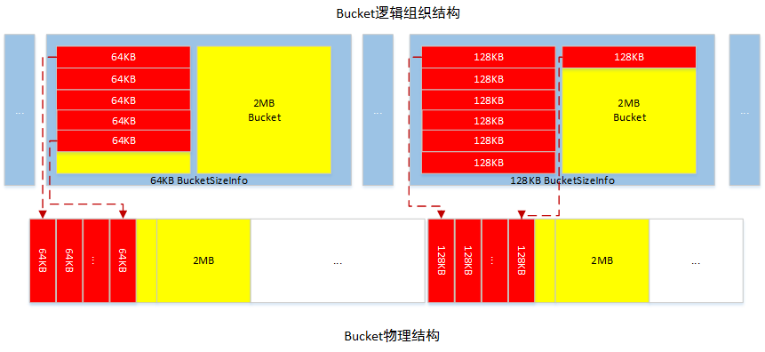
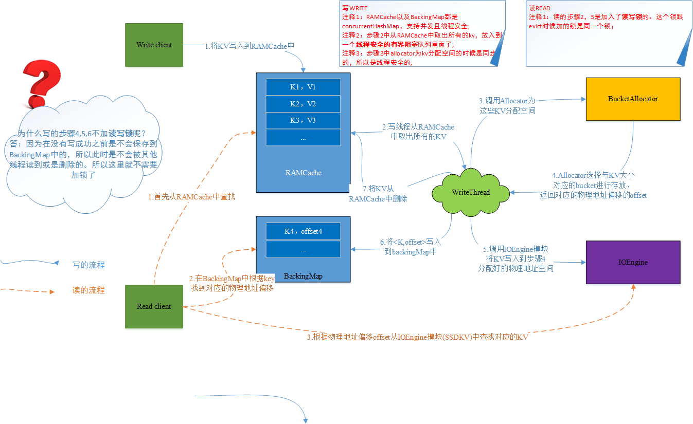
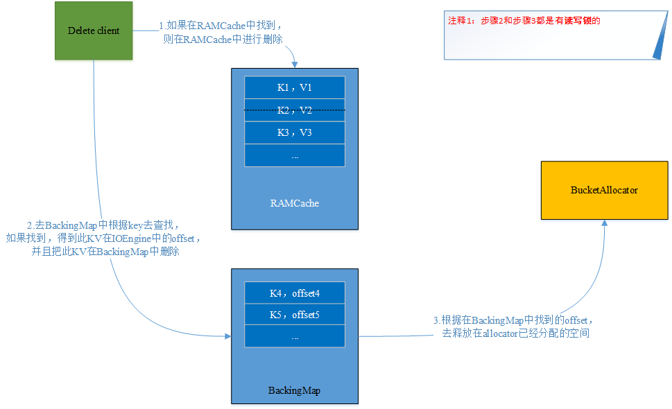

# ssdkv设计思想

## 1.以往工作基础-基于高速非易失存储的缓存管理
为了解决像[Alluxio](http://www.alluxio.org/)这种计算存储分离框架只支持大文件块的读写，不支持小文件块随机读写的问题。借鉴了[memcached](https://memcached.org/)以及[HBase](https://hbase.apache.org/)的内存管理方式，设计了如下的更加细粒度的数据访问接口。支持基于高速非易失存储的内存扩展。
### 1.1 存储的逻辑结构和物理结构

上图是存储的逻辑结构和物理结构图。根据配置文件，可以配置总体使用的扩展内存的大小，主要由以下配置信息组成(其他配置在此省略).根据配置文件会初始化为上图所示的结构。

| Parameters        | value           | Description  |
| ------------- |:-------------:| -----:|
| ssdkv.total.cache.size   | 20GB              |   总的使用的扩展内存的大小 |
| ssdkv.bucket.cache.size  | 2MB               |   每一个bucket的大小 |
| ssdkv.blocksize.list     | {4KB,8KB,64KB...}   |   在每一个bucket中细分配的block的大小|
    

### 1.2 数据的读写流程

读写流程如上图所示，写流程主要包含如下6步：
 - 1.首先将KV写到到内存的RAMCache中，此时算写入成功。返回给客户端。(具体语义可以根据实际情况在定);
 - 2.一个异步写线程从RAMCache中取出所有的KV数据对，保存在一个有界阻塞线程安全的队列中;
 - 3.遍历队列中的所有的KV，调用Allocator为每个KV分配合适其大小的block;
 - 4.Allocator会选择比KV的大小大的最小的一个block，分配给其进行存放，并且返回此block对应的物理地址的偏移offset;
 - 5.调用FileIOEngine模块，讲此KV写入到步骤4返回的offset对应的物理位置;
 - 6.步骤5写入成功之后，将此offset以及K写入到内存中的BackingMap中，供其他线程去读取新写入的KV;
 - 7.写入成功后，将KV从内存中的RAMCache中删除.

读流程主要包含如下3步：
- 1.首选从RAMCache中查找，因为所有新写入的数据都在RAMCache中；
- 2.如果在RAMCache中没有读到，则根据key去backingMap中读取其offset；
- 3.根据步骤2中返回的offset从IOEngine模块中的文件中去读取数据。

### 1.3 数据的删除(evict)流程

数据的删除(换出)流程比读写流程简单:
 - 1.如果在RAMCache中找到，则在RAMCache中进行删除；
 - 2.如果在RAMCache中没有找到，则根据key去BackingMap中查找，如果找到，返回其物理的offset；
 - 3.根据在BackingMap中找到的offset，去释放在Allocator中已经分配的空间。这样这块空间就可以被其他KV使用。

### 1.4 一些使用接口
- int();//根据配置参数，初始化bucket的逻辑组成结构
- setKV(key,value);//插入一个KV
- getValue(key);// 根据key，获取value
- deleteKey(key);//删除一个key，value对

